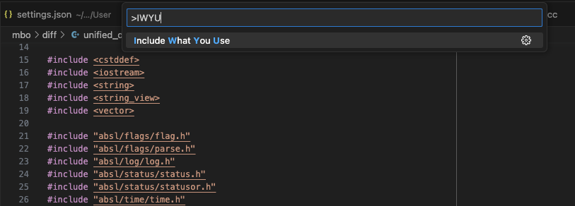

# Include What You Use

This extension integrates [include-what-you-use](https://github.com/include-what-you-use/include-what-you-use) or short
`IWYU` in `VScode`.

> QUOTE: "Include what you use" means this: for every symbol (type, function, variable, or macro) that you use in foo.cc
 (or foo.cpp), either foo.cc or foo.h should include a .h file that exports the declaration of that symbol. (Similarly,
 for foo_test.cc, either foo_test.cc or foo.h should do the including.) Obviously symbols defined in foo.cc itself are
 excluded from this requirement.

## Features

Optimize the include files for the current C/C++ file, press `cmd-shit-P` + `I` + `W` + `Y` + `U`:



## Requirements

This extension assumes C++ development using clang tools and compilers and a `compile_commands.json` database that
covers all C++ files. When building with bazel this can be autogenerated using
[hedronvision/bazel-compile-commands-extractor](https://github.com/hedronvision/bazel-compile-commands-extractor).

## Alternatives

This extension is a simple wrapper around the `include what you use tool` and similar to [pokowaka-iwyu](https://marketplace.visualstudio.com/items?itemName=pokowaka.pokowaka-iwyu). The reason for this extension is its debug and
filter capability.

`Clang` has an extra tool [clang-include-fixer](https://clang.llvm.org/extra/clang-include-fixer.html).

### include-what-you-use

Install [include-what-you-use](https://include-what-you-use.org/). For example on mac:

```sh
brew install include-what-you-use
```

## Extension Settings

This extension has the following general settings:

- `iwyu.compile_commands.json` Path to `compile_commands.json` file (supports `${workspaceFolder}` and
  `${workspaceRoot}`).
- `iwyu.debug`: Enables additional debug output (e.g. the iwyu output).
- `iwyu.include-what-you-use`: Path to the `include-what-you-use` executable.
- `iwyu.filter_iwu_output`: Regexp expression filter for iwyu output. This will be used as {hrere} in
  '#include.*({here})'. For instance in order to not add system includes under '__fwd/*.', set this to '<__fwd/'.
- `iwyu.fix_includes.py`: Path to the `fix_includes.py` script.

The `include-what-you-use` tool can be configured with the following settings (names and description taken from flags):

- `iwyu.iwyu.additional_params`: Additional parameters you wish to pass to iwyu. Must be prefixed with a `-Xiwyu` flag
- `iwyu.iwyu.keep`: A glob that tells iwyu to always keep these includes. Can be provided multiple times.
- `iwyu.iwyu.mapping_file`: Mapping file to use. See
   [IWYU Mappings](https://github.com/include-what-you-use/include-what-you-use/blob/master/docs/IWYUMappings.md) for
   details.
- `iwyu.iwyu.max_line_length`: Maximum line length for includes.Note that this only affects comments and alignment
   thereof, the maximum line length can still be exceeded with long file names
- `iwyu.iwyu.no_default_mappings`: Do not add iwyu's default mappings.
- `iwyu.iwyu.no_fwd_decls`: Do not use forward declarations.
- `iwyu.iwyu.transitive_includes_only`: Do not suggest that a file add foo.h unless foo.h is already visible in the
  file's transitive includes.

The `fix_includes.py` tool can be configered with the following settings (names and description taken from flags):

- `iwyu.fix.comments`: Put comments after the #include lines."
- `iwyu.fix.ignore_re`: Skip editing any file whose name matches this regular expression.
- `iwyu.fix.only_re`: Skip editing any file whose name does *NOT* match this regular expression.
- `iwyu.fix.reorder`: Re-order lines relative to other similar lines (e.g. headers relative to other headers).
- `iwyu.fix.safe`: Do not remove unused #includes/fwd-declares from header files; just add new ones.

Note that settings `iwyu.fix.ignore_re` and `iwyu.fix.only_re` are also used to determine whether execution can be skipped.

### How to Correct IWYU Mistakes

The IWYU tool can be debugged using the `iwyu.debug` setting. Once activated, the `IWYU` output window shows the
detailed command lines used and the output of the tool prior to sending it to the `fix_include.py` script.

#### Simple IWYU output filtering

If the tool geneally tries to add includes that should not be added, then these can be excluded using the
`iwyu.filter_iwyu_output` setting or mapping files (see below).

The following (`settings.json`) example suppresses adding system includes for `__fwd/*`.

```JSON
{
    "iwyu.filter_iwu_output": "<__fwd/"
}
```

The specified value is a reular expression that will be appended to `#include.*`. In the example this will create the
regular expression `#include.*<_fwd/`. When the iwyu tool runs, all lines matching that reular expression will be
filtered out. So when IWYU suggests to add `#include <__fwd/string_view.h>               // for string_view`, then that
line will simply be dropped.

#### In source control using comments

Taken from
[IWYU](https://github.com/include-what-you-use/include-what-you-use/blob/master/README.md#how-to-correct-iwyu-mistakes):

* If fix_includes.py has removed an `#include` you actually need, add it back in with the comment
  '`// IWYU pragma: keep`' at the end of the #include line. Note that the comment is case-sensitive.
* If fix_includes.py has added an `#include` you don't need, just take it out. We hope to come up with a more permanent
  way of fixing later.
* If fix_includes.py has wrongly added or removed a forward-declare, just fix it up manually.
* If fix_includes.py has suggested a private header file (such as `<bits/stl_vector.h>`) instead of the proper public
  header file (`<vector>`), you can fix this by inserting a specially crafted comment near top of the private file
  (assuming you can write to it): '`// IWYU pragma: private, include "the/public/file.h"`'.

#### Using a mapping file

The `fix_include.py` also supports a
[mapping file](https://github.com/include-what-you-use/include-what-you-use/blob/master/docs/IWYUMappings.md) that
allows to specify multiple mappings from private to public headers.

## Known Issues

The extension has only been tested on Linux/Mac. In particular the extension does not understand Windows line endings.

## Release Notes

### 0.0.1

Initial release.
